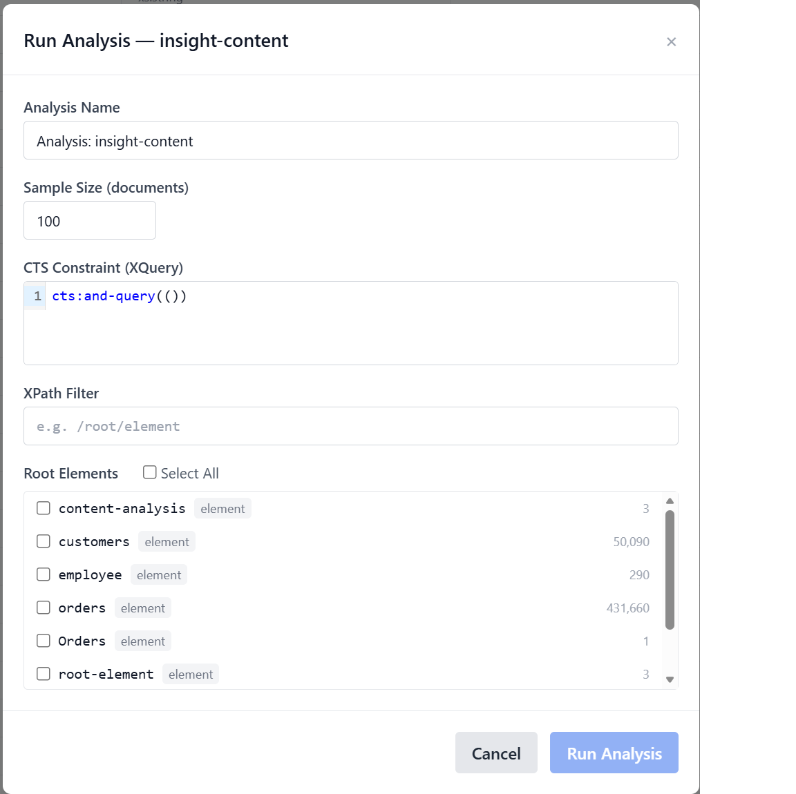
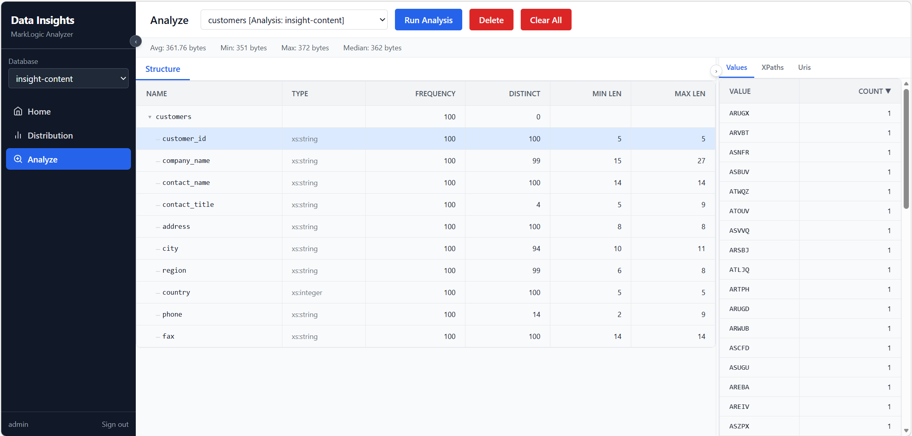
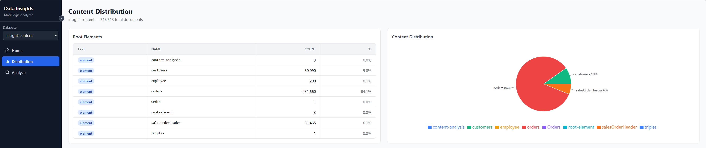

# How to Use Data Insights

This guide walks you through the key features of the Data Insights application for analyzing JSON and XML documents.

## Getting Started

### 1. Login to the Application

When you first open the application, you'll be presented with a login screen. Enter your credentials to access the analysis tools.

### 2. Select a Database

After logging in, you'll need to select which database to analyze. The database selector allows you to choose from available MarkLogic databases where your JSON and XML documents are stored.

## Running Analysis

### 3. Launch an Analysis Task

Click the "Run Analysis" button to start a new analysis task. This will open the analysis configuration modal.

In this modal, you can:
- Configure analysis parameters
- Select specific collections or documents to analyze
- Set output preferences

### 4. View Analysis Results

Once the analysis completes, you'll see the analysis results displayed on the screen.

The analysis view shows:
- An overview of the analyzed documents
- Key insights about document structure and formation
- Statistical summaries

## Understanding Data Patterns

### 5. Coverage Analysis

Navigate to the Coverage page to see which parts of your data have been analyzed and how thoroughly.

### 6. Distribution Analysis

View the Distribution page to understand the pattern and distribution of data across your documents.

The distribution view reveals:
- How data elements are spread across documents
- Frequency analysis of key structures
- Pattern recognition insights

## Best Practices

- **Start with small datasets**: Begin by analyzing a smaller collection to understand the tool's capabilities
- **Use meaningful configurations**: Configure your analysis parameters based on your specific data insights goals
- **Review coverage first**: Check the coverage page before running large analyses to understand data scope
- **Export results**: Save your analysis findings for documentation and reporting

## Tips & Tricks

- **Quick re-analysis**: Use the "Rerun" button to analyze the same dataset with different parameters
- **Batch operations**: The tool can handle large datasets efficiently for bulk analysis
- **Data validation**: Use analysis results to validate data quality and consistency

## Troubleshooting

If you encounter any issues:

1. **Connection errors**: Verify your MarkLogic database connection is active
2. **Analysis timeouts**: For large datasets, consider analyzing smaller collections first
3. **Missing data**: Ensure selected databases and collections contain the expected documents

For more detailed information, refer to the [Analysis Documentation](analysis.md).
